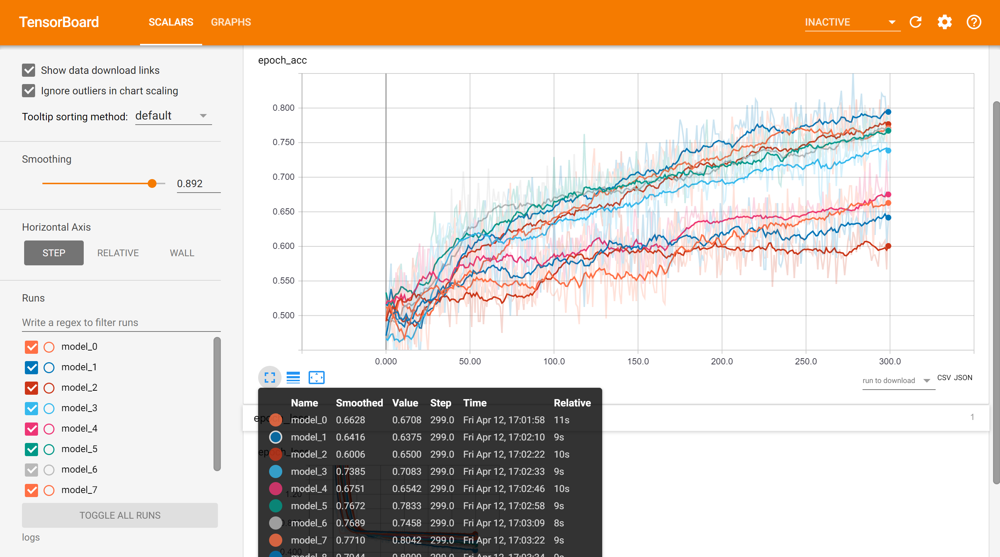
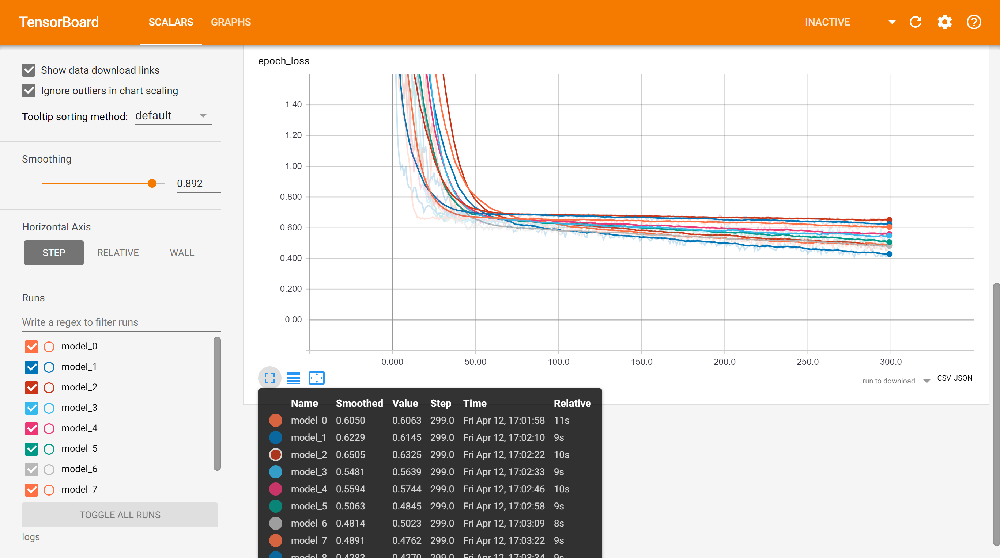

# Preterm/Term Labor Classification (ECE 4782 Final Project)

Use Physionet EHG preterm/term database to make a classifier. 
The classifier is able to classify whether the patient will have a preterm or a term labor,
using EHG signal features and past medical history.

[More in-depth project description](ProjectSummary.pdf)

Physionet database:
https://physionet.org/physiobank/database/tpehgdb/

## Getting Started

We are using Python 3x, pip, and pipenv.

### Prerequisites

Pipenv installation: 

```
pip install pipenv
```

### Installing

Once you have Python 3x, pipenv, and the repo downloaded, go to the root directory and initialize the pipenv and all of the dependencies:

```
pipenv install
```

## Running the tests

Running different files:
```
pipenv run .\[filename]
```

### Example
Running the main.py will print the accuracy, sensitivity, and specificity of our best classifier, model 6, and output a csv file with the sensitivity and specificity for each of the 30 trials.

```
pipenv run .\main.py
```

Model Accuracy:

Steadily improving with each epoch. 

Model Loss:

No overfitting. 

## Future Plans
Implement Random Forest, logistic regression, and other ML models

## Built With

* [pipenv](https://pypi.org/project/pipenv/) - The virtual environment
* [wfdb](https://pypi.org/project/wfdb/) - For downloading the Physionet's dataset
* [tensorflow](https://www.tensorflow.org/) - For building and evaluating the neural network
* [imbalanced-learn](https://pypi.org/project/imbalanced-learn/) - Used to balance the dataset
* [numpy](https://pypi.org/project/numpy/) - Used for fomatting the data
* [scikit-learn](https://pypi.org/project/scikit-learn/) - Used for splitting the data

## Authors

* **Dian Guo** 
* **Michael Isaf** 
* **Alexandra Melehan** 
* **Brandi Nevius** 

